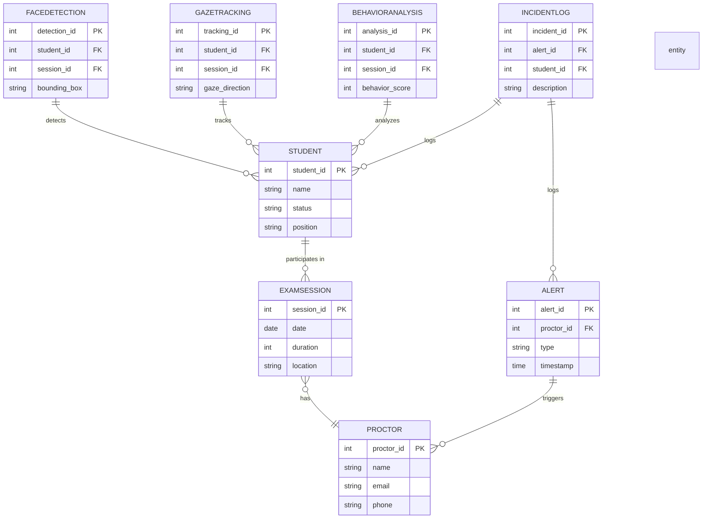

```mermaid
erDiagram
    STUDENT ||--o{ EXAMSESSION : "participates in"
    EXAMSESSION }o--|| PROCTOR : "has"
    FACEDETECTION ||--o{ STUDENT : "detects"
    GAZETRACKING ||--o{ STUDENT : "tracks" 
    BEHAVIORANALYSIS ||--o{ STUDENT : "analyzes"
    ALERT ||--o{ PROCTOR : "triggers"
    INCIDENTLOG ||--o{ ALERT : "logs"
    INCIDENTLOG ||--o{ STUDENT : "logs"

    entity STUDENT {
        int student_id PK
        string name
        string status
        string position
    }

    entity EXAMSESSION {
        int session_id PK
        date date
        int duration
        string location
    }

    entity PROCTOR {
        int proctor_id PK
        string name
        string email
        string phone
    }

    entity FACEDETECTION {
        int detection_id PK
        int student_id FK
        int session_id FK
        string bounding_box
    }

    entity GAZETRACKING {
        int tracking_id PK
        int student_id FK
        int session_id FK
        string gaze_direction
    }

    entity BEHAVIORANALYSIS {
        int analysis_id PK
        int student_id FK
        int session_id FK
        int behavior_score
    }

    entity ALERT {
        int alert_id PK
        int proctor_id FK
        string type
        time timestamp
    }

    entity INCIDENTLOG {
        int incident_id PK
        int alert_id FK
        int student_id FK
        string description
    }
```
